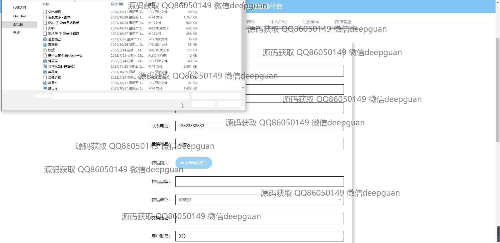
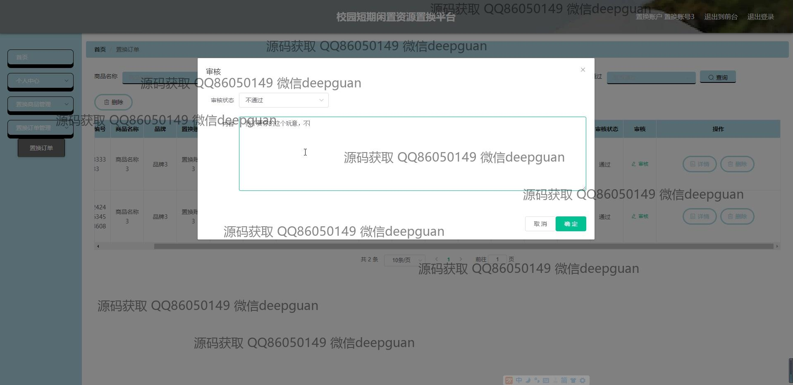

<h1 align="center">校园短期闲置资源置换平台</h1>

## 简介
校园短期闲置资源置换平台：角色分为管理员、用户；登录注册、资源发布、交流论坛、订单管理、在线客服等功能模块，支持商品展示、发表评论及审核管理，旨在促进校园资源的有效共享和利用。    --计算机毕业设计源码；毕设源码；java毕业设计源码

## 联系方式

<h3 align="center">获取完整代码与数据库文件 + 微信：deepguan QQ: 86050149 QQ群: 783742310</h3>

<h3 align="center">可帮忙远程部署 包运行成功！提供远程部署、修改代码、设计文档指导、代码讲解等服务！</h3>

## 功能介绍（完整见运行截图）
管理员：基本功能包括登录、账号和密码管理、角色设置及在线客服管理。网站首页含有导航栏功能，便于管理员访问后台管理、用户管理和商品管理等模块。管理员可在平台上进行公告发布、审核用户置换请求、处理置换订单，并能通过交流论坛管理帖子内容确保信息的健康度。在线客服提供支持，协助用户解决问题并优化平台交互体验。

用户：基本功能涵盖登录、注册和账号选择，用户可以在平台上发布、浏览和交换闲置资源。网站首页提供导航栏以便于访问置换商品、交流论坛、公告信息和个人中心等功能模块。用户可通过个人资料编辑更新联系方式、上传图片并与管理员或在线客服进行交流。用户还能在交流论坛互动发帖、发布评论，方便与其他学生交流和共享资源。平台支持订单管理，通过搜索和筛选查找资源，并允许用户收藏感兴趣的物品以便后续置换。

## 运行截图

本代码来源于网络,仅供学习参考使用!

